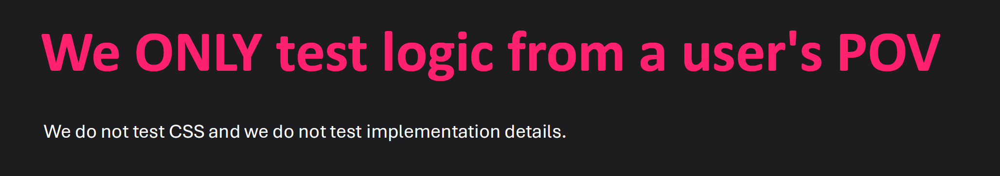

First of all, I would like to thank Vladislav [ (@Lesstread666)](https://github.com/Lesstread666) for providing the project and the initial test suite. These tests gave me a great starting point for this assignment.

# Feedback on the tests

I found the tests clear and easy to follow. The test names made it clear what each component was supposed to do, and I could usually figure out what I needed to build just by reading the tests.

They were also very helpful when developing the components. For example, the tests clearly showed what props `Square` needed, how it should behave when clicked, and what should happen after the game ended.

Overall, I think the provided tests cover the main game behaviours well and made the development process much easier.

## Additional tests

I didn't add any additional tests because I think the existing tests already cover the core behaviour of the application.

# What Could Be Improved

One thing I noticed is that some of the tests in `Square.test.tsx` specifically check CSS classes like `bg-green-500`, `bg-red-500`, and `bg-purple-950`.

The existing behavioural tests already cover things like winning and losing, so I don't think these style-related tests were necessary. Especially since, according to Rob's testing guidelines, tests should focus on logic from the user's perspective rather than CSS or implementation details.

I don't think `toHaveClass` is a bad matcher in and of itself. It seems to be useful in situations where a class represents a meaningful UI state, such as an `active` class on a navigation item or selected tab.

### Testing Guidelines

The following guideline from Rob's testing material was specifically relevant to this feedback:

